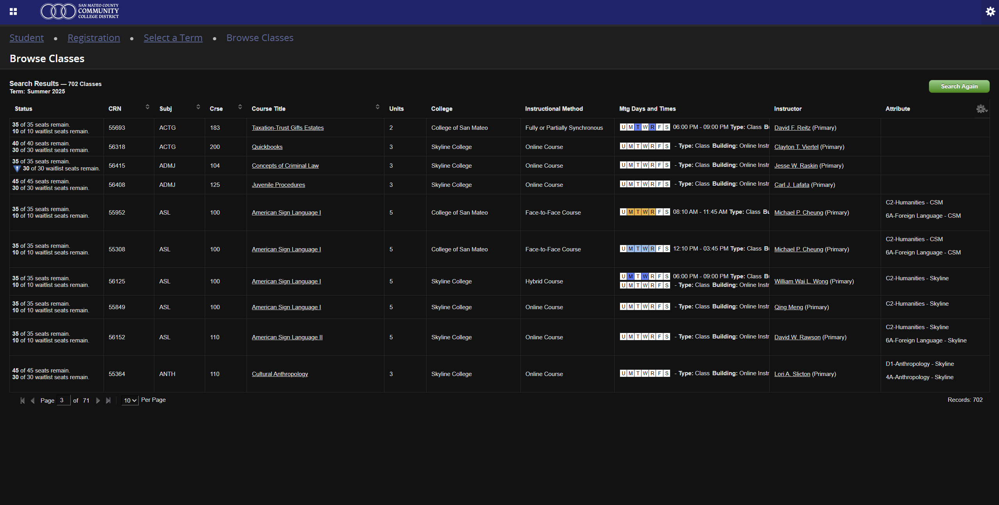
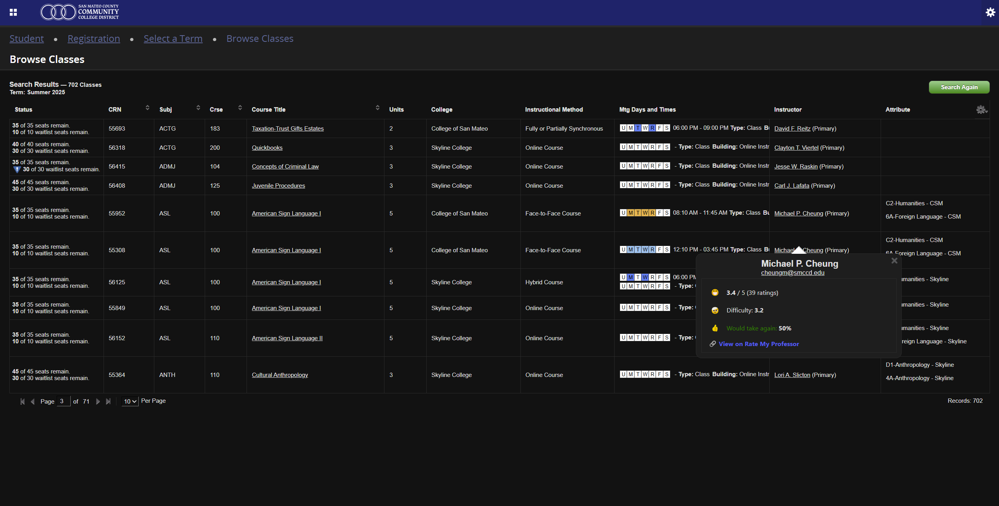
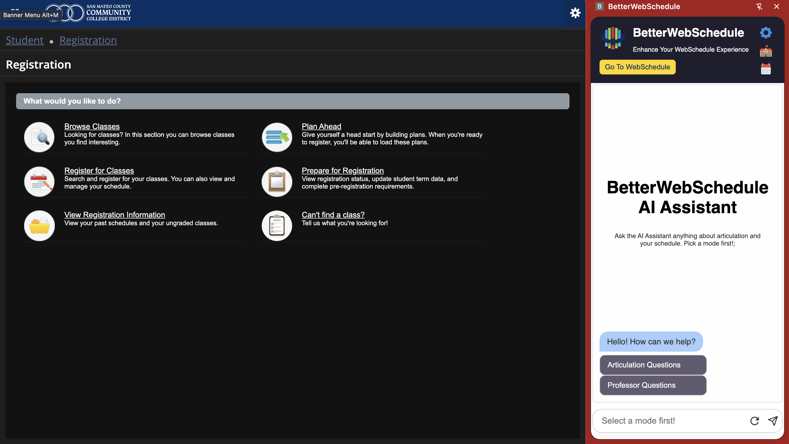
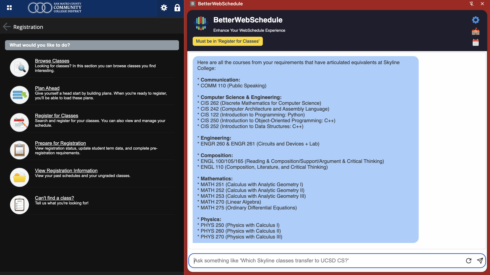

# 📅 BetterWebSchedule

_Powered by Google Cloud, Gemini AI, and Chrome Extensions_

**BetterWebSchedule** is an advanced Chrome extension designed to transform SMCCCD's WebSchedule system into a powerful academic planning assistant. By integrating AI-driven insights, RateMyProfessors, ASSIST, and intelligent scheduling tools, BetterWebSchedule empowers community college students to plan their academic journeys with confidence and ease.

---

## 🌟 Key Features

### Professor Insights

- Integration with RateMyProfessors.com
- AI-powered professor recommendations
- Instant rating cards with summarized RMP information
- Emoji indicators for quick-glance quality checks
- Direct links to full RateMyProfessors profiles

---

## 🚀 Intelligent Features

### 🤖 AI-Powered Professor Insights

- Analyzes RateMyProfessors data to recommend top instructors
- Suggests professors based on ratings, review counts, and sentiment
- Handles queries like "Who is the best Math professor at Skyline College?"
- Highlights trade-offs between rating quality and number of reviews

### 🧠 AI-Assisted Transfer Planner

- Trained on articulation data for 7 UC campuses and 100+ majors from ASSIST.org
- Answers questions like "Which Skyline classes transfer to UC Davis for Computer Science?"
- Generates step-by-step 2-year plans with prerequisite validation
- Supports complex articulation groupings (e.g., "Complete A or B" logic)

---

## 🧑‍💻 User Experience

- Light and Dark mode toggle
- Modern, clean, minimalistic UI
- Seamless integration with WebSchedule
- Responsive design for all screen sizes
- MapBox-powered interactive campus navigation
- Color-coded time blocks (Morning, Afternoon, Evening)
- One-click export to `.ics` calendar files (compatible with Google Calendar, Apple Calendar, Outlook, and more)

---

## 🏫 Multi-Campus Support

- ✅ Skyline College
- ✅ College of San Mateo
- ✅ Cañada College

---

## 📸 Screenshots

### 🌑 Dark Mode

### 🧑‍🏫 Professor Card

### 🏫🗺️ School Maps

### 🖥️ UI-Preview

### 🤖💬 AI-Chat

---

## 🚀 Getting Started

### 1. Cloning and Loading the Repository

- Open a terminal and run:
  git clone https://github.com/Htetty/BetterWebSchedule.git
  cd BetterWebSchedule

- Open Google Chrome and go to:
  chrome://extensions/

- Enable Developer Mode (toggle in the top-right corner)

- Click "Load unpacked"

- Select the BetterWebSchedule/ folder you just cloned

---

### 2. How to Use

- Visit WebSchedule: https://phx-ban-apps.smccd.edu/StudentRegistrationSsb/ssb/registration

- Browse classes and click on a professor’s name to view their RateMyProfessors ratings

- Click the BetterWebSchedule extension icon to open the side panel

- In the side panel, use the buttons to:
  - View a campus map with class locations
  - Export your class schedule as a .ics calendar file
  - Toggle Dark Mode for nighttime readability

---

## ⚙️ Technical Stack

### Frontend

- JavaScript
- HTML, CSS
- MapBox GL JS for map integrations

### Backend

- Python Flask server
- Deployed on Google Cloud Run
- Gemini AI (Google Generative AI) for NLP and smart responses

### Data & Automation

- Scraped RMP data from RateMyProfessors.com using Selenium
- Scraped articulation agreements from ASSIST.org using Selenium
- JSON-based local data storage
- Chrome Storage API for user persistence

---

## 🤝 Credits & Motivation

**By students, for students. Built with ❤️ to make college life a little easier.**

> Developed by **Htet Htwe**, **Myo Aung**, and **Giankyle Lopez**

> BetterWebSchedule was created to help fellow community college students navigate class planning, professor selection, and the complex transfer process more effectively. Our mission is to empower students with smarter tools backed by the most recent data and intelligent design.

All data integrations comply with fair use and are intended to assist—not replace—official academic advising.

---

## 📝 Disclaimer

Please consult your academic counselors for official course and transfer guidance.  
BetterWebSchedule is designed as a planning aid and should not replace professional advising.

---
