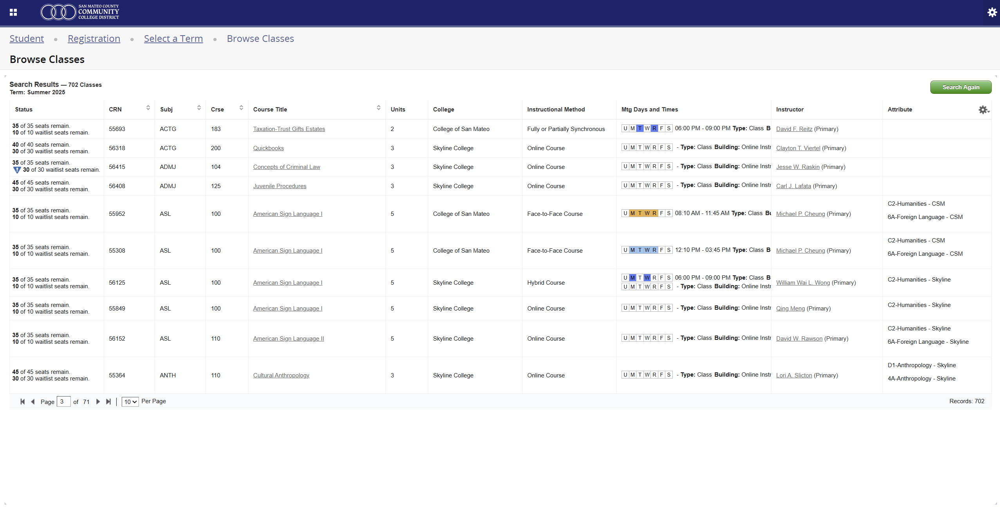
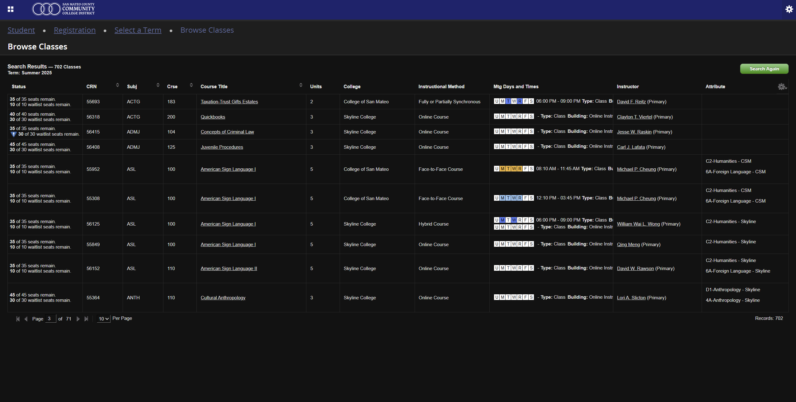
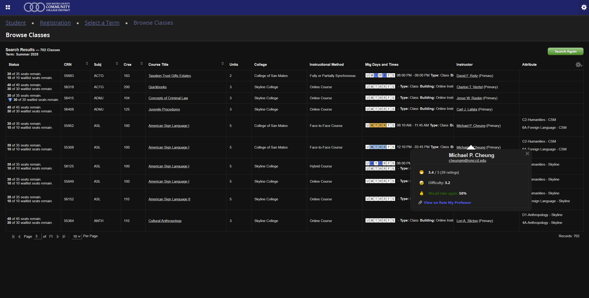
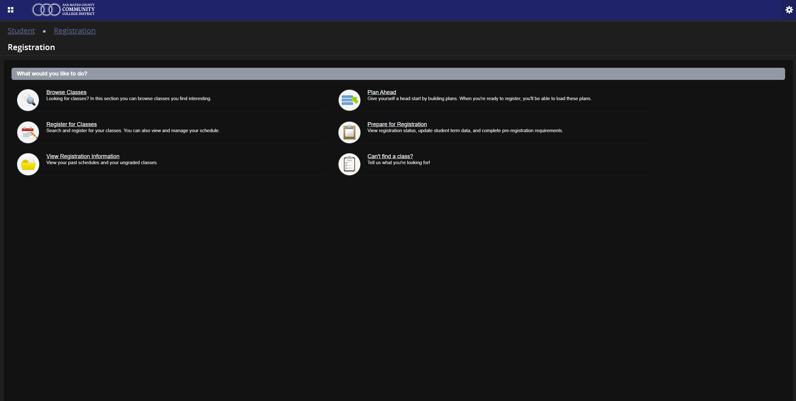

 # 📅 BetterWebSchedule

**BetterWebSchedule** is a Chrome extension that makes SMCCCD’s WebSchedule more useful by adding RateMyProfessors ratings and an optional dark mode. It's built to make picking classes easier and a little less stressful.

---

## 🌟 Features

- ✅ Displays real-time professor ratings from [RateMyProfessors.com](https://www.ratemyprofessors.com)
- ✅ Supports Skyline College, College of San Mateo, and Cañada College
- ✅ Adds emoji indicators for quick rating insights
- ✅ Toggle between stylish **Dark Mode** and the default **Light Mode**
- ✅ Cleanly styled info cards seamlessly integrated into the WebSchedule interface
- ✅ New: Color-coded class blocks to distinguish morning, afternoon, and evening sections

---

## 🎨 Screenshots

### 💡 Light Mode  

### 🌑 Dark Mode  

### 🧑‍🏫 Professor Card

### 🏠 Homepage

---

## ⚙️ Tech Stack

- **Languages**: JavaScript, Python, HTML, CSS  
- **Browser API**: Chrome Extensions API  
- **Automation**: Python + Selenium (for RMP data scraping)  
- **Styling**: Custom Dark/Light Mode with CSS  
- **Data Format**: JSON (static professor data)

---

## 🤝 Credits & Motivation

Built by [Htet Htwe](https://github.com/Htetty)

As a fellow community college student, I created BetterWebSchedule to make class selection easier and more informed. Finding the right professors can make a huge difference in academic success. I hope others enjoy using it as much as I enjoyed building it.

> Ratings sourced from [RateMyProfessors.com](https://www.ratemyprofessors.com)

---
